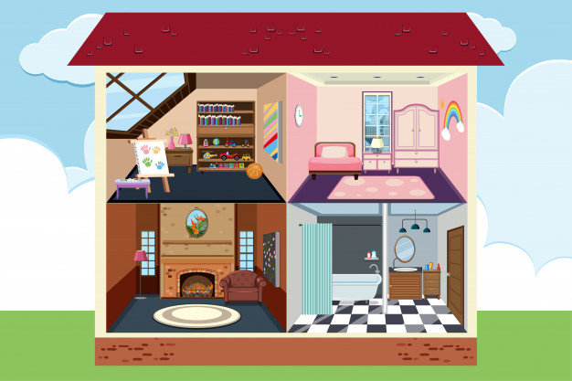

#### [Menu](../README.md)

# Conceptos básicos

## La nube

Prestación de Servicios Informáicos a través de internet.

 
 

| Nube Publica | Nube Privada | Nube Hibrida |
|--------------|--------------|--------------|
|Los recursos son priopiedad de los servicios de un tercero.| Los recursos son de la organización en su base de datos. | Combina ambas, permite que las aplicaciones se ejecuten en la ubicación más adecuada. |

### Escalabilidad
 * Vertical: Capacidad informática de aumentar RAM o CPU a una maquina virtual
 
 * Horizontal: Capacidad informática para aumentar instancias de un recurso, como maquinas virtuales adicionales a una configuración.

### Elasticidad

Si las aplicaciones en la nube se pueden configurar para escalado automático (Las aplicaciones siempre disponen de los recursos que necesitan).

### Agilidad

Si los recursos de la nube se pueden aplicar rápidamente a medida que cambias los requisitos de la aplicación.

### Alta disponibilidad

Recuperación ante desastres de recursos con copias de seguridad. 

### Tolerancia a fallos

Los datos se pueden implementar en centros regionales de todo el mundo.

### Modelos de servicio de la nube

|     PaaS     |     Saas     |     IaaS     |
|--------------|--------------|--------------|
| Plataforma como servicio (Plataform as a Service). Entorno para construir, probar e implementar aplicaciones de software. Ayuda a crear aplicaciones rapidamente sin centrarse en la infraestructura subyacente. Nosotros administramos la aplicación. | Software como servicio (Software as a Service). Software alojado y administrado para usuarios finales. Se conectan y usan aplicaciones basadas en la nube a través de internet. Como Microsoft 365. El proveedor de los servicios es el encargado de la administración. | Infraestructura como servicio (Infrastructure as a service). Categoría más básica de computación en la nube. Servicio de pago por uso donde se alquilan servidores, maquinas virtuales, almacenamiento, redes y sistemas operativos de operadores en la nube. La responsabilidad es mayor para nosotros. |

#### [Menu](../README.md)

## Infraestructura de Azure

### Region de Azure

Es una colección de centros de datos implementados dentro de un rango definido de latencia y conectados a través de una red regional dedicada de baja latencia.

Azure tiene un área global más grande que cualquier otro proveedor de nube, lo que brinda a los clientes la flexibilidad de implementar aplicaciones donde lo necesiten. Las regiones de Azure ofrecen precios discretos y disponibilidad de servicios.

### Geografia de Azure

La región geográfica de Azure es un mercado discreto, que generalmente contiene al menos una o más regiones y está sujeto al tiempo de residencia de los datos y a las restricciones de cumplimiento normativo. Las áreas geográficas permiten a los clientes con necesidades específicas de residencia de datos y cumplimiento normativo mantener sus datos y aplicaciones cerca. Debido a que el área geográfica está conectada a nuestra infraestructura de red de Azure dedicada de alta capacidad, puede tolerar interrupciones regionales completas.

Existen 5 diferentes Geografias, Americas, Europa, Asia Pacífico, Oriente medio y Africa.

### Zonas de disponibilidad

Es un producto de alta disponibilidad que protege las aplicaciones y los datos de las fallas del centro de datos. La zona de disponibilidad es la única ubicación física en la región de Azure. Cada zona disponible consta de uno o más centros de datos equipados con fuentes de alimentación, refrigeración y redes independientes. Para garantizar la resistencia, debe haber al menos tres áreas independientes en todas las áreas activas. El aislamiento físico de las zonas disponibles dentro de la región protege las aplicaciones y los datos de las fallas del centro de datos. 

Los servicios de redundancia regional replican aplicaciones y datos en las zonas de disponibilidad para evitar puntos únicos de falla. A través de la zona de disponibilidad, Azure proporciona el mejor SLA en la industria del tiempo de actividad de las máquinas virtuales con una precision de 99,99%.

#### [Menu](../README.md)

##  Servicios de Azure

 
 

### Compute Services

Servicios de computo o procesamiento bajo demanda para aplicaciones usadas en la nube.

Unos ejemplos serian:

* OneDrive de Microsoft

* iCloud de Apple

* Google Drive de Google

### Networking Services

Servicios de red que permiten conectarse entre diversos sitios.
Cada servicio generalmente lo proporciona un componente de servidor que se ejecuta en una o más computadoras

### Databases Services

Servicios de bases de datos que ofrece a los usuarios la posibilidad de descubrir, limpiar, mejorar, integrar y administrar datos, lo cual ayuda en la toma de decisiones.

### Storage

Suele ser la acción de guardar documentos o información en formatos ópticos o electromagnéticos en un ordenador, no obstante, esta acción dentro de las empresas implica una mayor responsabilidad debido al valor de lo que se almacena.

### Azure machine learning Services

Crea tu modelo de intelgencia artificial
Cree e implemente modelos de Machine Learning con rapidez usando herramientas que satisfagan sus necesidades, sea cual sea su nivel de conocimientos. 

### Azure Machine Learning Studio

Modelos entrenados de manera visual y colaborativa es un portal web en Azure Machine Learning que contiene opciones de código bajo y sin código para la creación de proyectos y la administración de activos.

### Azure cognitives Services

Tiene como objetivo ayudar a los desarrolladores a crear aplicaciones inteligentes sin la utilización de “inteligencia artificial directa” y sin la necesidad de aptitudes ni conocimientos sobre ciencia de datos.

### DevOps Azure
Es un conjunto de herramientas y servicios que te ayuda a administrar tus proyectos de desarrollo de software en todas sus fases.
Es un conjunto de herramientas y servicios que te ayuda a administrar tus proyectos de desarrollo de software en todas sus fases.

#### [Menu](../README.md)

# Comandos útiles

## Git 

## Actualizar repositorio local

    git pull

### Crear rama

    git checkout -b branch-name

### Moverse a otra rama

    git checkout branch-name

### Guardar cambios

    git add .

### Crear commit

    git commit -m "name"

### Subir cambios

    git push origin branch-name

[Menu](../README.md)
